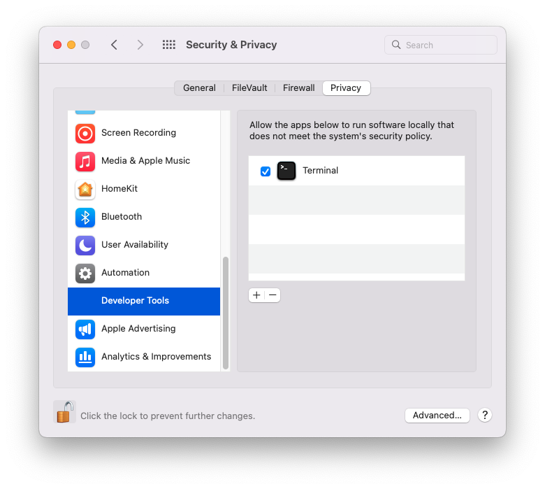

# Windows antivirus and macOS Gatekeeper

This page covers common performance issues caused by anti-malware protections on Windows and macOS. These performance issues are not unique to nextest, but [its execution model](how-it-works.md) may exacerbate them.

## Windows

Your antivirus software—typically Windows Security, also known as Microsoft Defender—might interfere with process execution, making your test runs significantly slower. For optimal performance, exclude the following directories from checks:

- The directory with all your code in it
- Your `.cargo\bin` directory, typically within your home directory (see [this Rust issue](https://github.com/rust-lang/cargo/issues/5028)).

[Here's how to exclude directories from Windows Security.](https://support.microsoft.com/en-us/windows/add-an-exclusion-to-windows-security-811816c0-4dfd-af4a-47e4-c301afe13b26)

## macOS

Similar to Windows Security, macOS has a system called Gatekeeper which performs checks on binaries. Gatekeeper can cause nextest runs to be significantly slower. A typical sign of this happening is even the simplest of tests in `cargo nextest run` taking more than 0.2 seconds.

Adding your terminal to Developer Tools will cause any processes run by it to be excluded from Gatekeeper. **For optimal performance, add your terminal to Developer Tools.** You may also need to run `cargo clean` afterwards.

### How to add your terminal to Developer Tools

1. Run `sudo spctl developer-mode enable-terminal` in your terminal.
2. Go to System Preferences, and then to Security & Privacy.
3. Under the Privacy tab, an item called `Developer Tools` should be present. Navigate to it.
4. Ensure that your terminal is listed and enabled. If you're using a third-party terminal like iTerm, be sure to add it to the list (You may have to click the lock in the bottom-left corner and authenticate).
5. Restart your terminal.

[See this comment on Hacker News for more.](https://news.ycombinator.com/item?id=24394150)

> There are still some reports of performance issues on macOS after Developer Tools have been enabled. If you're seeing this, please [add a note to this issue](https://github.com/nextest-rs/nextest/issues/63)!
